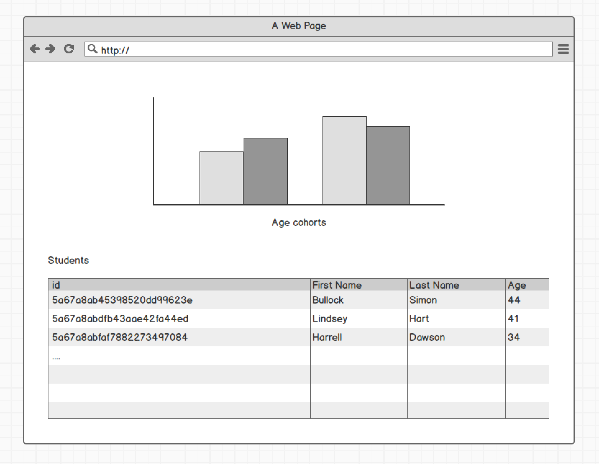

# tts-coding-challenge

1. How to install and start

- install node.js
- install npm -g
- open directory in console (or gitbash here on windows with gitbash installed)
- npm install (uses package.json to install dependencies)
- start command (node app.js) / alternative install nodemon --> start command nodemon
- start browser
- open localhost:3000 or 127.0.0.1:3000

2. Task
	1. Load the file data.json and put the content into a js array.
	2. Display the data in two ways: first in a normal html table, second in a bar chart. Please build a bar chart using __d3js__ from the data. The bar chart should represent the cohorts of students along their age. The age cohorts are:
	< 30 ; 31-35 ; 36-40 ; 41-45 ; 56-50 ; > 50

	

	3. Turn the bar chart into a filter: When a user clicks a bar, display only the values corresponding to that bar, i.e. only the line which belong to the selected age cohort. Highlight the active filter in the bar chart.
	4. Document your code inside the code, and write a short summary into the file myjourney.md. 
	